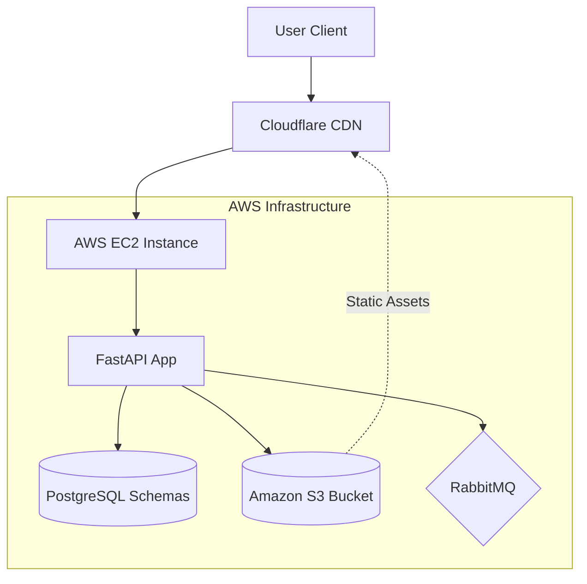
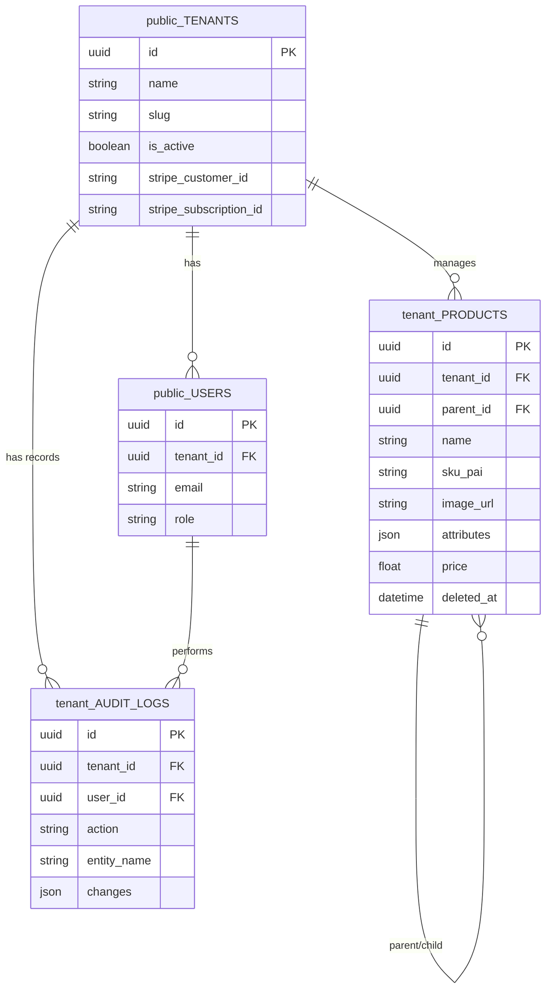

# NexCore SaaS API 🚀


NexCore is a robust, production-ready Multi-Tenant SaaS backend. In version 2.1.0, the architecture evolved to a **Cloud-Native Infrastructure**, migrating from local storage to **Amazon S3** with **Cloudflare Edge Caching**, alongside our **Enterprise Dedicated Schema** model, ensuring absolute physical data isolation and global scalability.

## 🏗️ Architecture & Stack
- **Framework:** [FastAPI](https://fastapi.tiangolo.com/) (Async, Type Safety, OpenAPI)
- **Cloud Infrastructure:** [AWS EC2](https://aws.amazon.com/ec2/) (Compute) & [Amazon S3](https://aws.amazon.com/s3/) (Object Storage)
- **Edge Strategy:** [Cloudflare](https://www.cloudflare.com/) (SSL/TLS Termination & Global CDN)
- **Database:** [PostgreSQL](https://www.postgresql.org/) with [SQLAlchemy 2.0](https://www.sqlalchemy.org/)
- **Multi-Tenancy:** Dedicated PostgreSQL Schemas (Physical Isolation)
- **Migrations:** [Alembic](https://alembic.sqlalchemy.org/) (Dynamic Schema Routing)
- **Cache & Rate Limiting:** [Redis](https://redis.io/)
- **Message Broker:** [RabbitMQ](https://www.rabbitmq.com/) (Event-Driven Background Tasks)
- **Containerization:** [Docker](https://www.docker.com/) & [Docker Compose](https://docs.docker.com/compose/)
- **Payments:** [Stripe Python SDK](https://stripe.com/docs/api)
- **CI/CD Pipeline:** GitHub Actions with ephemeral database provisioning and automated testing.

### ☁️ Cloud Infrastructure Topology
NexCore employs a decoupled storage strategy utilizing the **Strategy Pattern**. Relational data is isolated via PostgreSQL Schemas, while media assets are offloaded to Amazon S3 and served globally via Cloudflare CDN.



### 🗄️ Database Entity-Relationship (Physical Schema Isolation)
NexCore utilizes a strict multi-dimensional database topology. Global entities reside in the `public` schema, while each tenant gets a dynamically provisioned isolated schema (`tenant_<slug>`). Foreign keys securely cross these boundaries.



## 🌟 Key Features
- **Cloud-Native Storage:** Migrated media handling to Amazon S3 using asynchronous Boto3 sessions, preventing application blocking during heavy I/O operations.
- **Enterprise Multi-tenancy:** Physical data isolation via dynamically generated PostgreSQL schemas per tenant. Prevents data leakage at the database engine level.
- **Edge Security & Performance:** Integrated with Cloudflare for DDoS protection and global content delivery (CDN) for S3-hosted assets.
- **Cross-Schema Validation:** Employs raw SQL "Sniper Queries" to validate global states (e.g., Free Tier limits) directly from the `public` schema without losing the tenant's transaction context.
- **Backend for Frontend (BFF) Aggregation:** Optimized dashboard endpoints that perform heavy mathematical aggregations directly on the PostgreSQL engine, returning real-time executive summaries with zero application memory overhead.
- **Event-Driven Architecture:** Asynchronous background task processing using RabbitMQ (e.g., orphaned image cleanup and Discord Webhooks) to guarantee non-blocking HTTP responses.
- **Payment Gateway & Billing:** Stripe SDK integration using Atomic Database Transactions, paired with a secure Webhook listener.
- **High-Performance Ingestion (Bulk Insert):** Atomic batch processing for catalogs.
- **Audit & Traceability:** Immutable audit logging stored safely within the tenant's isolated dimension.
- **Performance & Observability:** Global rate limiting using the Sliding Window Counter algorithm via Redis. Centralized exception handler that sanitizes responses and dispatches real-time stack traces to Discord.

## 🚀 Getting Started

### Prerequisites
- Docker & Docker Compose installed.
- Stripe account (Test Mode Keys).
- AWS Account (S3 Bucket & IAM Credentials).

### Installation
1. Clone the repository:
   ```bash
   git clone [https://github.com/ccerks/nexcore-saas-api.git](https://github.com/ccerks/nexcore-saas-api.git)
   cd nexcore-saas-api
   ```
2. Configure environment variables:
   ```bash
   cp .env.example .env
   ```
   *Ensure you add `AWS_ACCESS_KEY_ID`, `AWS_SECRET_ACCESS_KEY`, and `AWS_S3_BUCKET` to your `.env` file.*
3. Spin up the infrastructure:
   ```bash
   docker-compose up --build -d
   ```
4. Run migrations (This creates the global schema architecture):
   ```bash
   docker-compose exec api alembic upgrade head
   ```
5. Provision the initial Administrator:
   ```bash
   docker-compose exec api python scripts/create_admin.py
   ```

The API will be available at `http://localhost:8000`
Check the interactive docs at `http://localhost:8000/docs`

## 💳 Stripe Setup & Local Testing
To handle real-time billing events (Webhooks) during development:

1. **Configure API Keys:** Add your `STRIPE_SECRET_KEY` and `STRIPE_WEBHOOK_SECRET` to `.env`.
2. **Start the Webhook Tunnel:** Use the Stripe CLI to forward events:
   ```bash
   stripe listen --forward-to localhost:8000/api/v1/payments/webhook
   ```

## 🗺️ Development Roadmap

- [x] **Phase 1: Foundation**
  - [x] Clean Architecture setup
  - [x] Docker & Docker Compose orchestration
  - [x] PostgreSQL & Redis integration
  - [x] Alembic migrations setup
        
- [x] **Phase 2: Identity & Base Multi-Tenancy**
  - [x] Tenant and User models
  - [x] JWT Authentication & RBAC
        
- [x] **Phase 3: E-commerce & Payments Core**
  - [x] Product and Inventory models
  - [x] Bulk Insert functionality (Horde Encounters)
  - [x] Stripe API integration & Webhook listener
        
- [x] **Phase 4: Performance & Observability**
  - [x] Advanced Rate Limiting with Redis
  - [x] Global exception handling and Discord alerts
  - [x] Backend for Frontend (BFF) Dashboard Analytics
  - [x] Automated Testing Suite (Pytest + Faker)

- [x] **Phase 5: Enterprise Architecture (v2.1.0 Cloud-Native)**
  - [x] Physical database isolation strategies (Dedicated Schemas)
  - [x] Asynchronous Storage I/O with Strategy Pattern
  - [x] **AWS S3 Integration & Cloudflare Edge Caching**
  - [x] Asynchronous messaging via RabbitMQ
  - [x] Tenant-level isolated audit logging
  - [x] Continuous Integration Pipeline (GitHub Actions)

**Developed by** [Caio Cerqueira](https://github.com/ccerks) 🚀