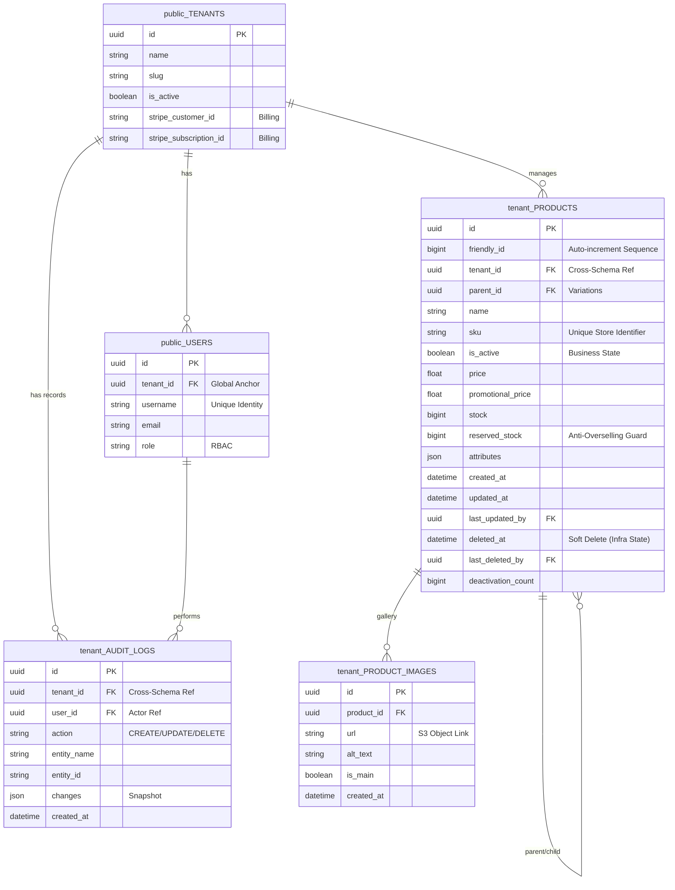

# NexCore SaaS API 🚀


NexCore is a robust, production-ready Multi-Tenant SaaS backend. In version 2.2.0, the architecture was upgraded to an **Enterprise Dedicated Schema** model with a fully Cloud-Native deployment, ensuring absolute physical data isolation, Edge Security, and real-time Observability via Prometheus.

## 🏗️ Architecture & Stack
- **Framework:** [FastAPI](https://fastapi.tiangolo.com/) (Async, Type Safety, OpenAPI)
- **Database:** [PostgreSQL](https://www.postgresql.org/) with [SQLAlchemy 2.0](https://www.sqlalchemy.org/)
- **Multi-Tenancy:** Dedicated PostgreSQL Schemas (Physical Isolation)
- **Observability:** Prometheus Metrics & Discord Alerts
- **Testing:** [Pytest](https://docs.pytest.org/) & [Faker](https://faker.readthedocs.io/) (TDD Approach with Dynamic Schema Routing)
- **Migrations:** [Alembic](https://alembic.sqlalchemy.org/) (Dynamic Schema Routing)
- **Cache & Rate Limiting:** [Redis](https://redis.io/)
- **Message Broker:** [RabbitMQ](https://www.rabbitmq.com/) (Event-Driven Background Tasks)
- **Async I/O Storage:** `aiofiles` for non-blocking local media handling
- **Cloud Infrastructure & Storage:** AWS ECS Fargate (Serverless Compute), AWS ALB (Load Balancing), AWS ACM (SSL), Cloudflare DNS, and AWS S3
- **Containerization:** [Docker](https://www.docker.com/) & [Docker Compose](https://docs.docker.com/compose/)
- **Validation:** [Pydantic V2](https://docs.pydantic.dev/)
- **Security:** JWT Authentication & Cross-Schema SQL Sniper Queries
- **Payments:** [Stripe Python SDK](https://stripe.com/docs/api)
- **Front-End:** Vanilla HTML/CSS/JS Premium Landing Page

### 🗄️ Database Entity-Relationship (Physical Schema Isolation)
NexCore utilizes a strict multi-dimensional database topology. Global entities reside in the `public` schema, while each tenant gets a dynamically provisioned isolated schema (`tenant_<slug>`). Foreign keys securely cross these boundaries.



## 🌟 Key Features
- **Enterprise Multi-tenancy:** Physical data isolation via dynamically generated PostgreSQL schemas per tenant. Prevents data leakage at the database engine level via a strict `get_tenant_db` dependency router.
- **Edge Security & HTTPS:** Production deployment behind an AWS Application Load Balancer with strict SSL/TLS encryption and Cloudflare Proxy.
- **Observability (APM):** Prometheus `/metrics` exposition tracking request latency, status codes, and HTTP method distributions in real-time.
- **Cross-Schema Validation:** Employs raw SQL "Sniper Queries" to validate global states (e.g., Free Tier limits) directly from the `public` schema without losing the tenant's transaction context.
- **Superadmin Impersonation:** Advanced contextual switching (Ephemeral DNA Injection) allowing global superadmins to operate within specific tenant boundaries securely.
- **Continuous Deployment (CI/CD):** Fully automated GitHub Actions workflow targeting Amazon Elastic Container Registry (ECR) and AWS ECS Fargate for zero-downtime rolling updates. Secrets are securely injected in-memory at runtime via AWS SSM Parameter Store.
- **Asynchronous Cloud Storage:** AWS S3 integration decoupled via RabbitMQ workers. Bulk Multipart Form-Data uploads are processed instantly using a flexible Storage Strategy, while deletion routines run non-blocking in the background.
- **Query Optimization:** Implemented SQLAlchemy Eager Loading (`selectinload`) to eliminate N+1 query bottlenecks on nested 1:N relationships.
- **Payment Gateway & Billing:** Stripe SDK integration for customer provisioning using Atomic Database Transactions, paired with a secure Webhook listener.
- **High-Performance Ingestion (Bulk Insert):** Atomic batch processing for catalogs, ensuring database integrity with automatic full-batch rollbacks on SKU conflicts.
- **Event-Driven Architecture & BI:** Asynchronous background task processing using RabbitMQ. New tenant provisions and critical catalog deletions automatically trigger real-time Discord Business Intelligence (BI) webhooks.
- **Advanced Catalog:** Complex product management supporting hierarchical SKU variations, JSON-based dynamic attributes, promotional pricing, reserved stock guards, and auto-incrementing friendly IDs via PostgreSQL sequences.
- **Idempotent Soft-Delete & Traceability:** Robust `PATCH /restore` mechanism paired with immutable audit logging stored safely within the tenant's isolated dimension.
- **Backend-For-Frontend (BFF):** Aggregated dashboard metrics endpoint designed to reduce client-side network round-trips and optimize initial load times.
- **Performance & Security:** Global rate limiting using the Sliding Window Counter algorithm via Redis. Centralized exception handler that dispatches real-time stack traces to Discord.

## 🚀 Getting Started

### Prerequisites
- Docker & Docker Compose installed.
- Stripe account (Test Mode Keys).
- AWS Account (ECS Cluster, ALB, ECR Repository, S3 Bucket & IAM Keys).

### Installation (Local Development)
The project is containerized for seamless replication. Any developer can spin up the entire architecture locally:

1. Clone the repository:
   ```bash
   git clone https://github.com/ccerks/nexcore-saas-api.git
   cd nexcore-saas-api
   ```
2. Configure environment variables:
   ```bash
   cp .env.example .env
   ```
3. Spin up the infrastructure:
   ```bash
   docker-compose up --build -d
   ```
4. Run migrations:
   ```bash
   docker-compose exec api alembic upgrade head
   ```
5. Provision the initial Administrator:
   ```bash
   docker-compose exec api python scripts/create_admin.py
   ```
6. Provision the Global Superadmin:
   ```bash
   docker-compose exec api python scripts/create_superadmin.py
   ```

The API will be available at `http://localhost:8000`
Check the interactive docs at `http://localhost:8000/docs`

### 🧪 Running Tests
The project includes a dedicated Test Environment with deterministic database isolation logic to simulate production cross-schema operations.
```bash
docker compose exec api python -m pytest tests/
```

## 💳 Stripe Setup & Local Testing
To handle real-time billing events (Webhooks) during development:

1. **Configure API Keys:** Add your `STRIPE_SECRET_KEY` and `STRIPE_WEBHOOK_SECRET` to `.env`.
2. **Start the Webhook Tunnel:** Use the Stripe CLI to forward events:
   ```bash
   stripe listen --forward-to localhost:8000/api/v1/payments/webhook
   ```

## 📡 Observability & Monitoring
The system features a Global Exception Handler and Prometheus Metrics exposition.

- **Discord Integration:** Any `500` error or system bootstrap triggers an automated webhook alert. Payload Sanitization ensures end-users see a safe message, while engineers get the full stack trace.
- **Prometheus APM:** Request metrics are exposed at `/metrics` to track API health, latency, and status code distributions in real-time.

## 🛠️ Project Structure
```text
  app/
  ├── api/         # Route handlers (Endpoints)
  ├── core/        # Global configs (Security, Env, Metrics)
  ├── db/          # Session management & engine
  ├── models/      # SQLAlchemy database models
  ├── schemas/     # Pydantic data contracts
  ├── services/    # Business logic (Service layer)
tests/             # Automated test suite (Pytest + Faker)
scripts/           # Utility for initial system setup
infrastructure/    # AWS ECS Fargate JSON Task Definitions
.github/workflows/ # CI/CD Deployment pipelines
```

## 🗺️ Development Roadmap

- [x] **Phase 1: Foundation**
  - [x] Clean Architecture & Docker Orchestration
  - [x] PostgreSQL, Redis & RabbitMQ integration
        
- [x] **Phase 2: Identity & Multi-Tenancy**
  - [x] Tenant and User models with Physical Isolation logic
  - [x] JWT Authentication & RBAC (Superadmin, Admin, User)
        
- [x] **Phase 3: E-commerce & Payments Core**
  - [x] Product models, consolidated SKUs & Stripe integration
  - [x] Bulk Insert functionality (Horde Encounters)
  - [x] 1:N Product Images Architecture (Multipart & S3)
  - [x] Idempotent Soft-Delete Restoration
        
- [x] **Phase 4: Performance & Observability Core**
  - [x] Redis Rate Limiting & Global Exception Handling
  - [x] Automated Testing Suite (Pytest + Faker)
        
- [x] **Phase 5: Enterprise Architecture (v2.0.0--beta)**
  - [x] Physical database isolation (Dedicated Schemas)
  - [x] Alembic dynamic routing logic for multi-tenancy
  - [x] Asynchronous messaging via RabbitMQ
  - [x] Backend for Frontend (BFF) Dashboard Analytics
  - [x] Event-Driven Discord Business Intelligence (BI) Alerts

- [x] **Phase 6: Cloud-Native Evolution (v2.1.0--beta)**
  - [x] AWS S3 Asset Offloading (Strategy Pattern)
  - [x] Continuous Deployment (CD) pipeline via GitHub Actions
  - [x] AWS Elastic Container Registry (ECR) pipeline integration
  - [x] Infrastructure scaling (AWS ECS Fargate Serverless)
  
- [x] **Phase 7: Edge Security & Domain (v2.1.1--beta)**
  - [x] Cloudflare DNS & Edge Caching
  - [x] Application Load Balancer (ALB) & Custom SSL Integration
  - [x] Premium Landing Page Showcase

- [x] **Phase 8: Observability & APM (v2.2.0--beta)**
  - [x] Prometheus `/metrics` exposition
  - [x] Latency, HTTP status, and Request volume tracking

- [ ] **Phase 9: Reliability (Planned)**
  - [ ] Idempotency Keys (Redis)
  - [ ] Semantic Caching

**Developed by** [Caio Cerqueira](https://github.com/ccerks) 🚀
